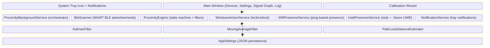
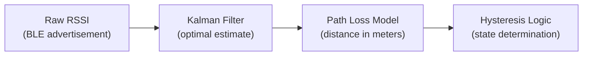
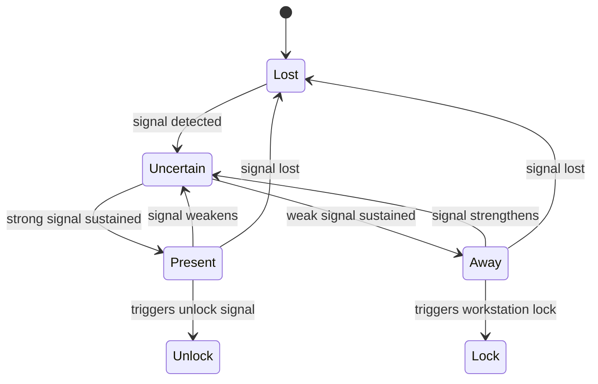

# Architecture

## System Overview

ProximityD is a layered WPF application built on .NET 8 with dependency injection (`Microsoft.Extensions.Hosting`).

## Signal Processing Pipeline

Raw Bluetooth RSSI (Received Signal Strength Indicator) is inherently noisy. ProximityD uses a **1D Kalman filter** to produce smooth, reliable distance estimates:

1. **Raw RSSI** → Noisy signal from BLE advertisement
2. **Kalman Filter** → Optimal estimate of true signal strength
3. **Path Loss Model** → Optional conversion to distance in meters
4. **Hysteresis Logic** → State determination with separate thresholds

## Proximity State Machine

### Hysteresis (Anti-Oscillation)

To prevent false lock/unlock cycles, ProximityD uses separate thresholds with time delays:

- **Lock triggers** when smoothed RSSI drops below `-75 dBm` for **10 seconds** continuously
- **Unlock triggers** when smoothed RSSI rises above `-65 dBm` for **5 seconds** continuously
- The **10 dBm gap** between thresholds prevents rapid toggling

## WiFi Hybrid Presence

When enabled, a secondary WiFi check pings a configured hostname or IP address. This reduces false locks when BLE signal is temporarily weak (e.g., device orientation, body blocking):

- BLE says **Away** but WiFi ping **succeeds** → state remains **Uncertain**
- Both BLE and WiFi say **Away** → lock triggers

## Security Considerations

- **Auto-lock**: Uses `LockWorkStation()` Win32 API — safe and reliable
- **Auto-unlock**: Disabled by default. Windows intentionally restricts programmatic unlock for security. When enabled, ProximityD shows a system tray notification prompting Windows Hello authentication.
- **Fail-safe**: If uncertain about proximity state, the system does NOT unlock
- See [CredentialProvider.md](CredentialProvider.md) for information on building a Custom Windows Credential Provider for true silent auto-unlock.

## Tech Stack

| Component | Technology |
|-----------|-----------|
| Language | C# (.NET 8.0) |
| UI Framework | WPF (Windows Presentation Foundation) |
| Bluetooth | WinRT `Windows.Devices.Bluetooth.Advertisement` APIs |
| Signal Graphing | OxyPlot.Wpf |
| Signal Processing | Kalman filter, Moving Average filter, Log-Distance Path Loss model |
| Architecture | MVVM with dependency injection (`Microsoft.Extensions.Hosting`) |
| Logging | Serilog (file-based, rolling daily) |
